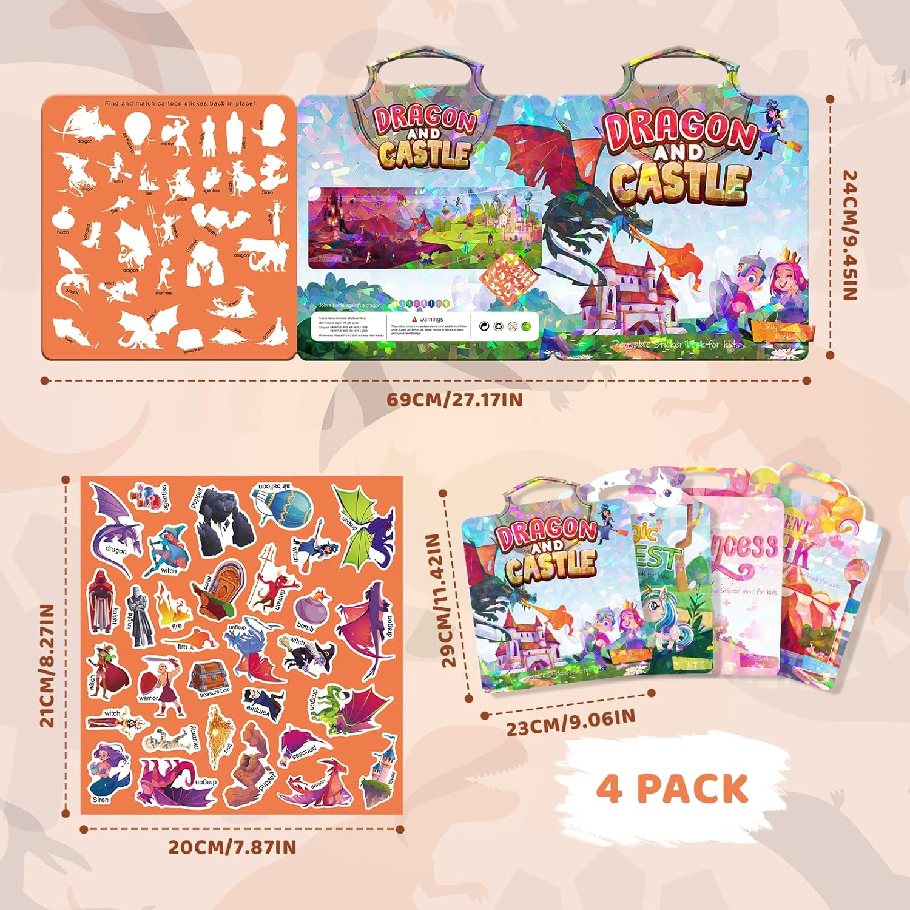

# Baby Adventures — Avventura a stickers "Drago e Castello"

Skill **text-only** per l'app **Google AI Edge Gallery** (modelli Gemma
on-device, funziona anche offline). Trasforma il modello in un **cantastorie /
game master** che inventa una storia dolce per bimbi di **4 anni** e suggerisce
**quali stickers spostare** sul tabellone di carta *Dragon and Castle* per far
andare avanti l'avventura.

## Cosa serve
* Il tabellone/sticker book **Dragon and Castle** (foto qui sopra).
* L'app **Google AI Edge Gallery** installata sul telefono, con un modello
  Gemma scaricato (consigliato un modello della famiglia Gemma recente).

## Come installare la skill in AI Edge Gallery
1. Copia sul telefono la cartella `baby-adventures` (basta il file
   `SKILL.md`; `board-reference.png` è solo un promemoria per te).
2. In **AI Edge Gallery** apri la sezione **Skills** e importa/aggiungi la
   skill dalla cartella (oppure incolla il contenuto di `SKILL.md` come
   **System Prompt** in **AI Chat** dalla pagina di configurazione).
3. La skill si attiva da sola quando scrivi il comando di avvio (vedi sotto),
   perché l'app la sceglie in base a **nome + descrizione**.

> Nota: se la tua versione dell'app non ha ancora la sezione *Skills*, usa il
> testo di `SKILL.md` come **System Prompt** in *AI Chat*. Funziona uguale.

## Come si gioca (per l'adulto)
Il vero "giocatore" sei tu adulto: **leggi ad alta voce** e **sposti gli
stickers**; il bimbo ascolta, sceglie e muove le manine.

1. Apri **AI Chat** e scrivi: **`inizia avventura`**
   (vanno bene anche *"giochiamo al drago e castello"* o *"avventura drago"*).
2. Il cantastorie ti saluta, chiede il nome del bimbo e fa scegliere un
   personaggio. Rispondi al posto del bimbo (o riporta quello che dice).
3. Ad ogni turno ricevi:
   * 📖 una-due frasi da **leggere ad alta voce**,
   * 🧩 **una mossa**: quale sticker spostare e verso quale zona,
   * ❓ una **domanda con 2 scelte**.
   Sposti lo sticker, fai scegliere il bimbo, scrivi la risposta e si va avanti.
4. Dopo 5-8 mosse arriva un **finale felice**. Poi potete rigiocare.

## Com'è pensata
* **Tutto gentile, niente paura:** draghi, streghe e vampiri sono buffi; nessun
  pericolo vero, nessun "hai perso", finisce sempre bene.
* **Frasi cortissime** in italiano semplice, adatte a un bimbo di 4 anni.
* **Un passo alla volta:** una mossa e una domanda per turno, poi si aspetta.
* Il modello **non vede** il tabellone: conosce i personaggi e le **zone a
  parole** (Castello Buio a sinistra, Prato Verde a destra, Sentiero, Cielo,
  Bordo del Bosco), così le indicazioni sono sempre chiare.

## Personalizzare
* **Lingua:** la skill è in **italiano** (istruzioni e racconto). Per l'inglese
  o una versione bilingue, tradurre `SKILL.md`.
* **Altri tabelloni:** questa avventura è per *Dragon and Castle*. Gli altri
  tabelloni della confezione (Magic Quest, Princess, Enchanted Park) possono
  diventare nuove skill con i loro personaggi e zone.

Il formato della skill segue la specifica ufficiale di Google AI Edge Gallery:
<https://github.com/google-ai-edge/gallery/tree/main/skills>
